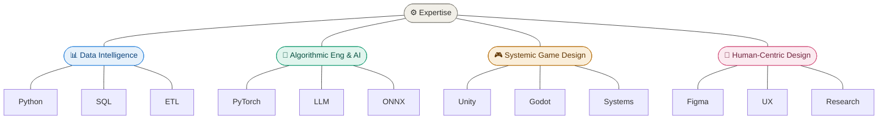

# 🌌 Alridho Tristan Satriawan
**Exploring the Intersection of Logic, Data, and Digital Systems**

---

*"Turning complex variables into elegant, functional solutions."*

---

### 🧬 The Core Stack

### 🔭 Expertise Domains

---

### 🛠️ Technical Toolkit

| Category | Skills |
| :--- | :--- |
| **Analysis** | [cite_start]Statistical Modeling, Data Visualization, Market Trends [cite: 13, 55, 56, 66] |
| **Development** | [cite_start]Python, Java, SMT Solvers, Godot Engine  |
| **Logic** | [cite_start]Abstract Algebra, Linear Algebra, Cryptography [cite: 55, 61] |
| **Creative** | [cite_start]UI/UX Research, Prototyping, Infographic Design [cite: 14, 20, 25] |

---

### 📫 Get in touch
[Email](mailto:alridho.tristan@gmail.com) • [LinkedIn](https://www.linkedin.com/in/alridho.tristan-satriawan)

---
$$Logic + Creativity = Innovation$$

